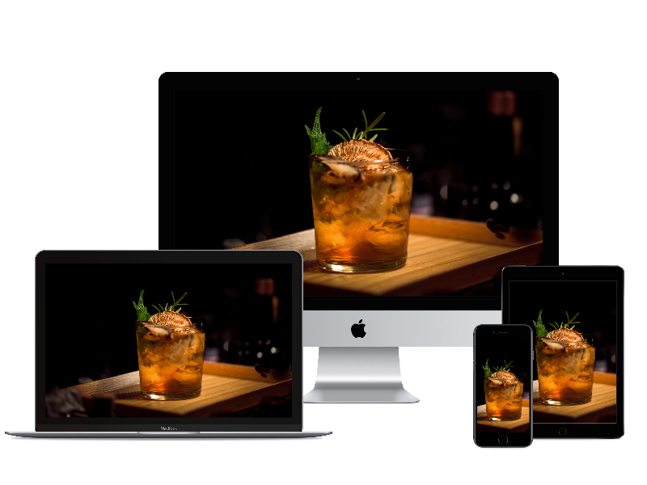
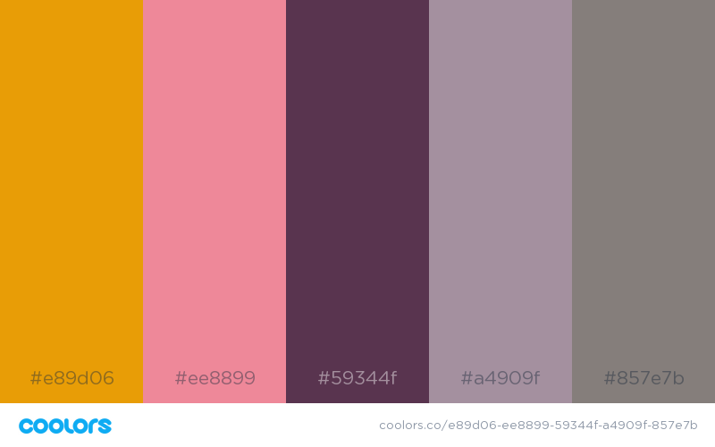
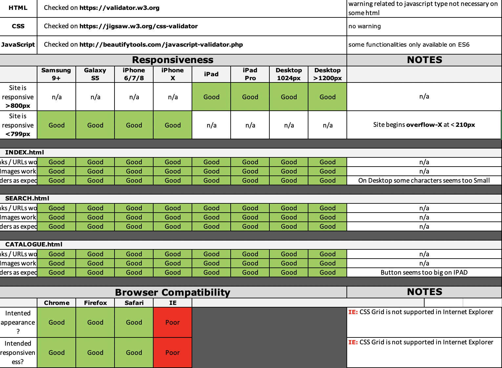

[](https://gitpod.io/#https://github.com/severian5it/CocktailWebApp)  


<div align="center">
    <h1>  Cocktail Database </h1>
</div>

<div align="center">
    <a href="https://severian5it.github.io/CocktailWebApp/"> View  Live Website</a>
</div>




## Table of Contents
1. [UX](#ux)
    - [Ideal Client](#The-ideal-client-for-this-business-is)
    - [Visitors' Searches](#Visitors-to-this-website-are-searching-for)
    - [Project's Purpose](#This-project-is-the-best-way-to-help-them-achieve-these-things-because)
    - [Visitor Stories](#visitor-stories)
    - [Wireframes](#wireframes)

2. [Features](#features)
    - [Existing Features](#existing-features)
        - [Navbar](#Navbar)
        - [Landing](#Landing-Page)
        - [Search](#Search)
        - [Catalogue](#Catalogue)
        - [Random](#Random)
        - [Contact](#Contact-Form)
        - [Footer](#Footer)
        - [Alternate Language](#Alternate-Language-Version)
        - [Colors Palette](#Colors-Palette)
        - [Fonts](#Fonts)

    - [Features for Future Releases](#features-for-future-releases)

3. [Technologies Used](#technologies-used)
    - [Libraries](#libraries)
    - [Tools](#tools)


4. [Testing](#testing)
    - [Manual Testing](#Manual-Testing)
    - [Automatic Testing](#Automated-Testing)

5. [Deployment](#deployment)

6. [Credits](#credits)
    - [Content](#content)
    - [Images](#images)
    - [Code](#code)
    - [Acknowledgements](#acknowledgements)

8. [Contact](#contact)

My project is leveraging *free Json API* from [CocktailDB](https://thecocktaildb.com/), Creating a 
front end interface that allow a the website visitor to do the following:
* Browse all the cocktails in the DB, paginated by letter.
* Get a random cocktail.
* Find out all the cocktails feasible with a specific ingredient.
* Suggest to the webmaster any cocktail in particular to include.
 
# UX

This is a website allowing different kind of selection operations over the Cocktail DB, the purpose
of the project is to allow visitors to extract information quickly and in different way.

### The ideal client for this business is:
First and foremost, potential tourists or visitors, for every period of the year. Rome is a good destination regardless
of the season; then the site is targeting in particular:

* People without means of transportation.
* High-Spending segment, because it's located in a central and expensive neighbourhood.
* Returning clients, who wants to keep contact.
* Tourist that would like to enrich their experience with guided tours.

### Visitors to this website are searching for:
* Cocktail recipe for a specific cocktail.
* Random Suggestion to prepare a cocktail.
* Contact the webmaster for suggestions.
* Pictures of the Cocktail.
* Browser all the cocktail.


### This project is the best way to help them achieve these things because:

Barman or Amateur looking for a cocktail need to make an informed decision and they want to explore
all the potential opportunities, not only in visual terms, but also having an ordered list of the 
ingredients. 
The site is presenting them, in a concise and easy-to-use way, everything they need to know.

The goal was to make a strong first impact with the landing page, and therefore move the exploration
and the research on other pages.

* Picture landing page, for a striking first impression and link to functionalities.
* Catalogue with alphabetic navigation, each letter invoking an *API*.
* A Search by ingredients, page each request calling an *API*.
* A random functionality, calling an *API* and displaying a modal.
* A Modal invoking an *API* callable clicking on a Cocktail card.
* A Contact modal, sending mail to the webmaster.

### Visitor stories

As a visitor of the *Cocktail DB* website I expect the following:

1. To find with ease what I am looking for, I want the layout of the site to make sense so I am not 
confused or frustrated using it. 

1. The information I am presented with to be laid out in a way that is easy for me to digest, so 
that I find my way  through in the quickest possible way.

1. The site to be easily navigable from any device, desktop, tablet or phone. For the content to 
look good and be usable on any of these devices.

1. To learn more about the cocktails I see and their recipe, so that I can prepare them when I want.

1. To find all the cocktails I can with ingredients available.

1. To know how to prepare a cocktail.

1. Plenty of high quality images of the Cocktails I can prepare.

1. To be able to get in contact with WebMaster in a quick and easy way.

1. To have random suggestions when undecided.


### Wireframes

Wireframe mockups, created using [Balsamiq](https://balsamiq.com/), is available in diffent format:
 1. Laptop
    1. [Landing](assets/Wireframes/LandingLaptop.pdf)
    1. [Search](assets/Wireframes/SearchLaptop.pdf)
    1. [Catalogue](assets/Wireframes/CatalogueLaptop.pdf)
 1. Tablet
     1. [Landing](assets/Wireframes/LandingTablet.pdf)
     1. [Search](assets/Wireframes/SearchTablet.pdf)
     1. [Catalogue](assets/Wireframes/CatalogueTablet.pdf)
 1. Mobile
     1. [Landing](assets/Wireframes/LandingMobile.pdf)
     1. [Search](assets/Wireframes/SearchMobile.pdf)
     1. [Catalogue](assets/Wireframes/CatalogueMobile.pdf)
 

# Features

All the different part of the project are detailed below.
 
## Existing Features

### Navbar
A responsive navigation bar with link to the landing page on top left. For mobile-sized devices a 
hamburger button on  the top-right expands a menu with links to the different section on the website. 
On larger devices the expanded menu is shown instead. Navigation bar will be static on the top of 
the page, and will have a peach gradient color.
### Landing Page
Landing Page presents a picture of a cocktail, along with a presentation heading, that introduces a 
visitor to the main features of the site: the search and the explore
### Search
A dedicated page for search has been designed, mimic google functionality, with a single search box, 
that gets moved when the search by ingredients is executed. A series of Card appears as a results.
Each of them is clickable and call an *API* which populates a modal with cocktails instruction and 
ingredients. 
### Catalogue
A dedicated section to Browse Catalogue has been designed, with a toolbar for each alphabet letter. 
Clicking on each alphabet letter, the section below gets populated with a series of Card.
Each of them is clickable and call an *API* which populates 
### Random
This functionality is available only by the menu, and a Random cocktail is displayed by a modal, after
an *API* call.
### Contact Form

This page includes a form with 4 required fields:
* Name
* Title
* Email Address
* Message

JS controls have been implemented to avoid leaving the fields empty or to submit invalid mail addresses.
Once the form has been validated, a *mail* will be sent to my personal mail address and the modal 
will be closed. In case of not validated fields, the user will see them with a wrong label displayed.

### Footer

On the very bottom of the page a footer has placed, with a really simple design and warning about
the creater. The footer is moving according to the number of cocktail displayed.


### Colors Palette



Peach has been used in Landing Page, along a combination of dark colour, while in features page, 
gradient of peaches and white, along with a simple design has been used.

### Fonts

From Google Fonts has been used *Open Sans* font; for the rest of the Headings *Arial* standard font
 has been used.

## Features for future releases
- allowing visitors to search directly from landing pages, but for this some back end technologies
would be needed.

# Technologies Used

## Libraries

Beside the holy trinity of Web Development, HTML, CSS and JavaScript, I took advantage of the following technologies:

- [JQuery](https://jquery.com)
    - The project uses **JQuery** to improve Scroll Up between Section and to show a *Modal* after submitting Contact 
    Form.
- [Bootstrap](https://getbootstrap.com/)
    - The project relies heavily on **Bootstrap** component and predefined styles.
- [FontAwesome](https://fontawesome.com/)
    - **FontAwesome** is the source of the icons.
- [Material Design for Bootstrap](https://mdbootstrap.com//)
    - has been used for some component, such as the contact modal and the button group.
- [Google Fonts](https://fonts.google.com/) 
    - to style the website fonts
- [Email.js](https://emailjs.com/) 
    - to allow the contact form to send mail
    
## Tools

In terms of Tools I used the following tools, to develop and design:

- [PyCharm](https://www.jetbrains.com/pycharm/)
    -  My favourite IDE, used to generate a local website and edit each file.
- [Balsamiq](https://balsamiq.com/)
    - WireFrame Designer, used with CodeInstitute license, definitively to best resource to wireframe.
- [Google Chrome](https://www.google.com/chrome/) and [Firefox](https://www.mozilla.org/en-US/firefox/new/)
    - Site has been tested on both popular Browser for several distinct dimensions.
    

# Testing

## Manual Testing

I used following validator to check the validity of the website code:

* **css**: [W3C CSS Validation Service](https://jigsaw.w3.org/css-validator/) 
* **HTML**: [W3C Markup Validation Service](https://validator.w3.org/)
* **JavaScript**: [JavaScript Beautify Tools](http://beautifytools.com/javascript-validator.php)

The work has been reviewed by a number of relatives and friend, mostly on the mobile,
each of them giving suggestions.

The website has been test with multiple resizing to test the its responsiveness.
via the *inspect* chrome functionality it has been examined for the most popular mobile devices such as 
* Samsung 9+
* iPhone 6/7/8
* iPhone X
* iPad
* iPad Pro
* Galaxy S5

also following section has been tested:

1. Navbar: navigating through different pages and calling random feature.

1. Search: calling different ingredients, and testing different results.

1. Contact form via the following routine:
    1. Going to the "Contact" Section
    2. Trying to submit the empty form and verify that an error message about the required fields appears
    3. Trying to submit the form with an invalid email address and verify that a relevant error message appears
    4. Trying to submit the form with all inputs valid and verify that the mail is sent correctly.

1. Catalogue, browsing all the alphabet letters.

1. Random Features, calling each time a different cocktail.

1. Landing Page, accessing all the page of the site.

I kept track of all the test on this [matrix](assets/test/manualTest.xlsx)



## Automated Testing

All 15 functionalites of the JavaScript functions have been tested by **Jasmine**. It took me 
some time to figure out how to process Fetch call, and I implemented it with promises.
The automated testing functionalities was really helpful to prevent any code regression, and 
test can be executed at this [link](https://severian5it.github.io/CocktailWebApp/test.html).


Bugs: most relevant bugs to tackle involved *bootstrap4 card* and they were shown after being 
returned by API query; in the first stage of the development they were managed by long JavaScript 
code, in the latest stage card-deck class by bootstrap was solving most of the issue.

Other problems were given by how to access all the informations provided by the JSON APIs, but this 
required more patience than anything less

# Deployment

Site has been developed on PyCharm and pushed to GitHub via terminal commands.
code can be fetched locally with following command
```shell
git clone https://github.com/severian5it/CocktailWebApp.git
```
This particular project does not require any local deployment.

Deployment and source control was entirely done via GitHub. My repository can be found here:

* **Repo**: https://github.com/severian5it/CocktailWebApp
I've published the source code built from the master branch using **GitHub Pages**.

The live site can be found here:

* **GH Pages**: https://severian5it.github.io/CocktailWebApp/
There are no difference between the deployed version and the development version.

GitHub Page as been chose for simplicity of deployment. 

# Credits

### Content
- The structure of the project was modeled on the examples provided by the **Code Institute**, in particular on 
[Haley Schafer Portfolio](https://github.com/Code-Institute-Solutions/StudentExampleProjectGradeFive)

Really useful resources during development were [W3school](https://www.w3schools.com/) and [Stack Overflow](https://stackoverflow.com/)
and [Rapid API](https://rapidapi.com/), which provided a lot of example to place my work on.


## Media
- The photo used in the Landing section was downloaded from [Unsplash](https://unsplash.com/), and credit goes to 
to [*Ash Edmonds*](https://unsplash.com/@badashproducts).
- While the structure of the Site is mine, all the back end api are provided by [CocktailDB](https://cocktaildb.com/)
## Acknowledgements

- I received inspiration and guidance for this project from my mentor, *Aaron Sinnot*, and from 
*Simen Daehlin*.

# Contact
To contact me feel free to email

 `pdelbuono@gmail.com`


